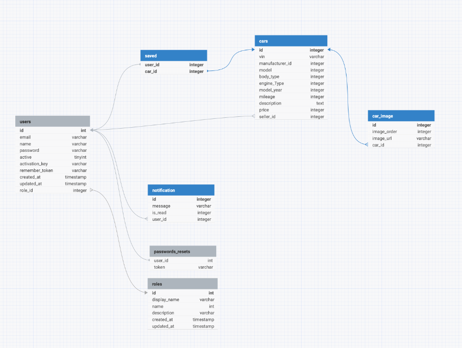
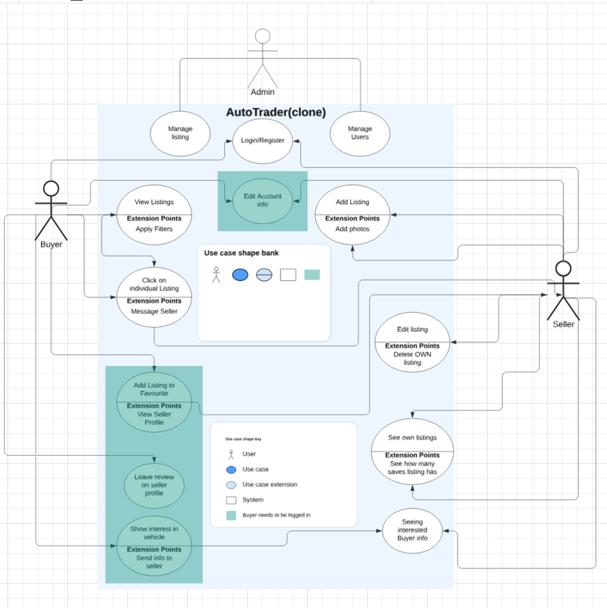
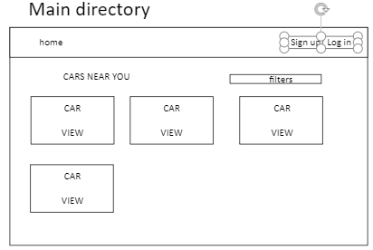
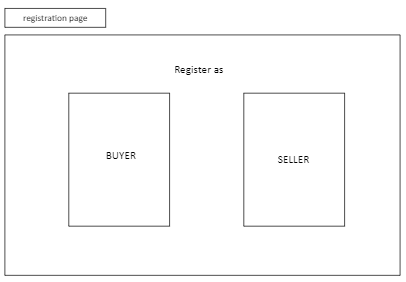
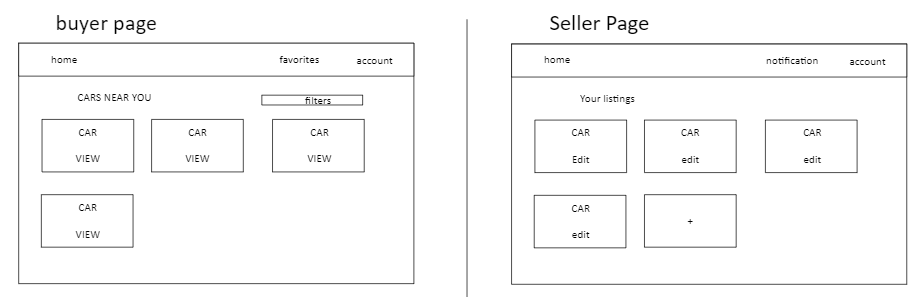
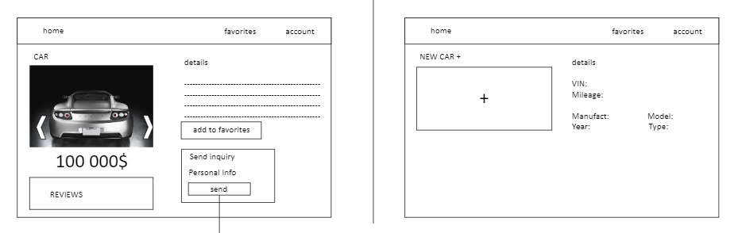
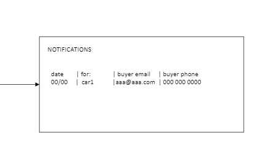

# CarNet

AutoTrader Clone

## Team Members
- [Danny](https://github.com/hdcola) - Team Lead, Backend, CI/CD
- [Kirill]() - Frontend, Unit Testing
- [Michael]() - Cloud, Frontend, Unit Testing

## Project Description

For this project, we will be making an Auto-Trader clone app. The main purpose of the app is to allow online selling and buying of vehicles. clone that will have 3 roles(buyer, seller, admin).  Anyone can register either as a buyer to view, save and choose cars, or register as a seller to create and manage listings for any buyer to visit. Administrators can delete messages or accounts that may be spam.

The app will attempt to establish a connection between the buyer and seller. When a buyer is interested in an article, they can choose to send their contact information to the seller. The seller will be notified and receive that potential buyer’s information in their account.

## Technologies Used

- 	Spring Boot/Spring Security/Thymeleaf
-	Bootstrap(CSS) / HTMLX(AJAX)
-	Heroku
-	MySQL
-	Amazon S3(file upload)
-	Google Login
-	Google Reviews
-	Docker
-	Python VIN info Restful API Server(python vininfo lib)
-	Junit/Mockito/AssertJ/Spring Test
-	Send SMTP/Telegram/Discord notification(Maybe use SQS)
-	CRUD
-	Github Action/CI/CD

## Special features

Buyer:
-	Send contact info to Seller
-	Reviewing Seller on their profile (Ratings)
-	Saving listings under “Favorites” filter

Seller:
-	View interested buyer contact info 
-	Upon registration, have the option to pay for extra advertising for your car

Admin:
-	Filters upon car search
-	Deletion of listings
-	Managing Users (both Buyer and Seller)

## Challenges

-	Deploying to the cloud, configuring Cloud Databases, configuring Containerized Apps
-	Figuring out how to separate the access based on roles
-	For the front end, making separate interfaces and keeping it efficient (try to make fewer templates that mostly change based on the role instead of numerous templates)

## URLs being handled

-	/login
-	/register
-	/notifications
-	/register/seller
-	/register/buyer
-	/ 
-	/listings
-	/listings/{id}
-	/profile/{id}
-	/seller/addlisting
-	/seller/mylistings
-	/seller/editlisting/{id}
-	/admin/manageuser
-	/admin/managelistings

## Database design

## Use Case Diagram

### A BUYER user can:

WITHOUT LOGIN:
-	View listings near his entered location and filter through them to select most plausible one
-	View any listing details, scroll though photos
-	a Buyer user can send his contact info to the Seller user of the specific listing
-	Can view and edit Account info

WITH LOGIN:
-	add a specific listing to his favorite listings 

### A SELLER user can:

(ALWAYS WITH LOGIN)
-	Add cars for sale
-	View, Edit, Delete those cars
-	(feature) in a special menu, option his car to be advertised
-	View and manage his Notifications (sent to him by Buyer user)

### AN ADMIN user can:

-	Manage Listings/Users (View/Delete)

## Wireframes

Main Directory: Listing of cars

Account Directory: can signup/in as buyer/seller

Buyer/Seller Account Pages:

Car Details (View for Buyer/ Add for Seller)

Notification snippet for Seller User: the Seller will see a table of the notifications 

